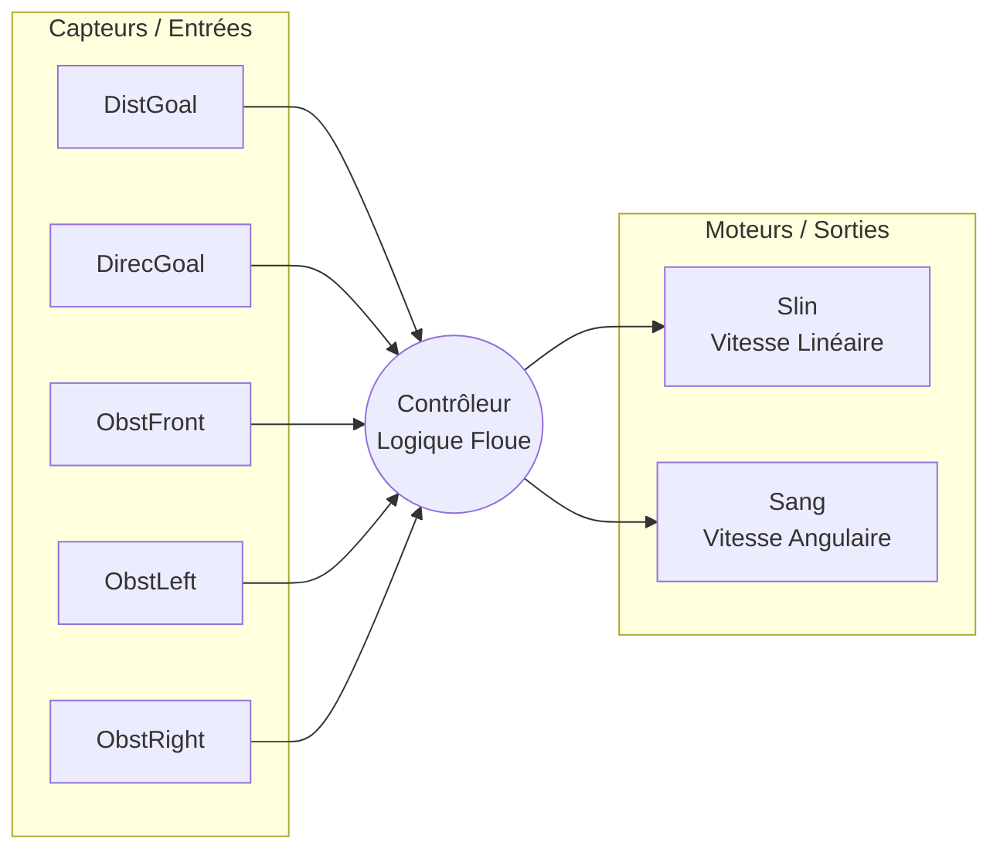
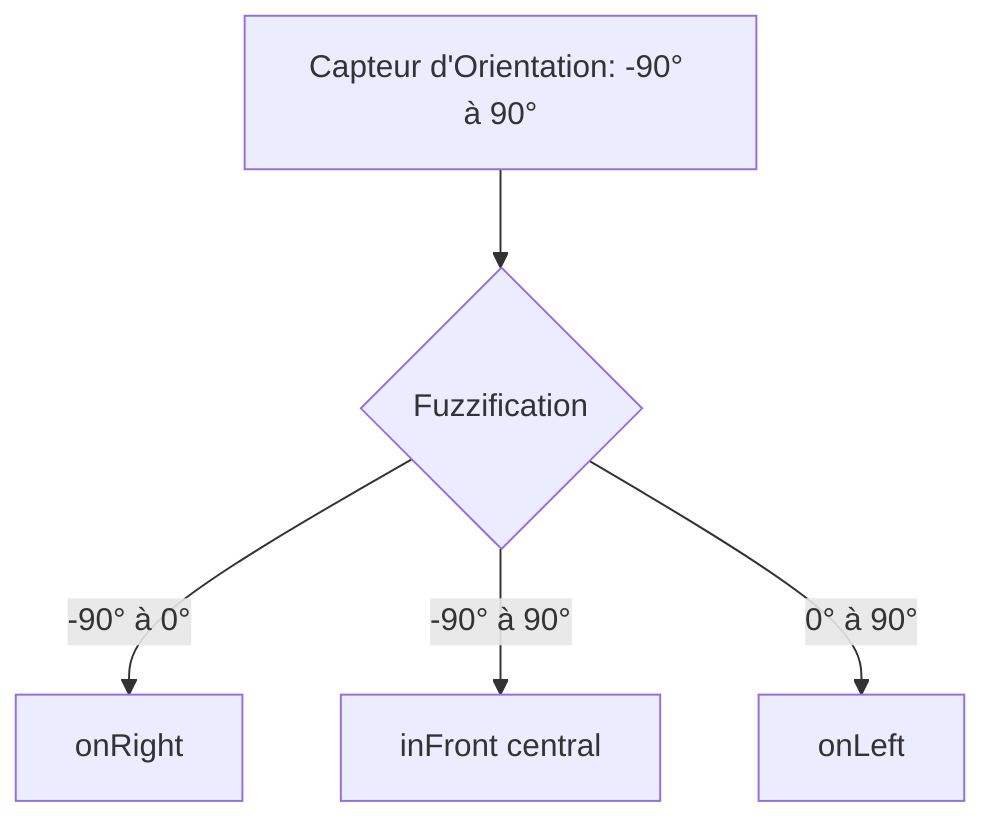
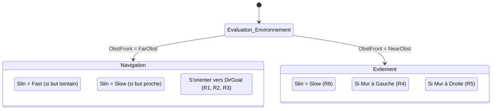
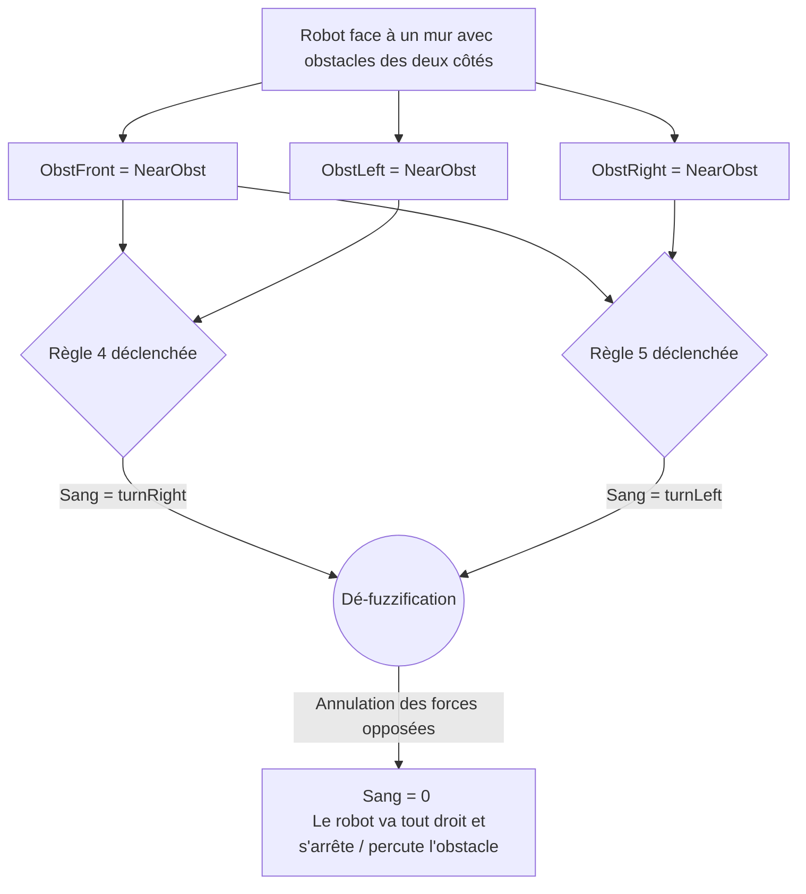

# Compte Rendu : Contrôleur Flou pour la Navigation de Robot

## 1. Architecture du Système

Le contrôleur flou permet de diriger le robot vers un objectif tout en évitant les obstacles en modulant deux sorties :
- **Slin** : Vitesse linéaire (Avancer).
- **Sang** : Vitesse angulaire (Tourner).

### Schéma des Entrées / Sorties

---

## 2. Variables Linguistiques et Ensembles Flous

Les variables d'environnement sont traduites en concepts qualitatifs (ensembles flous) :

*   **Distance au But (`DistGoal`)** : `Near` (Proche), `Far` (Loin).
*   **Distance des Obstacles (`Obst...`)** : `NearObst` (< 250), `FarObst` (> 120).
*   **Direction du But (`DirecGoal`)** : `onRight` (A droite), `inFront` (En face), `onLeft` (A gauche).
*   **Vitesse Linéaire (`Slin`)** : `Slow` (Lent), `Fast` (Rapide).
*   **Vitesse Angulaire (`Sang`)** : `turnRight` (Droite), `straightOn` (Tout droit), `turnLeft` (Gauche).

### Représentation des Fonctions d'Appartenance (Exemple d'Orientation)

---

## 3. Logique de Contrôle et Règles

Le comportement du robot est divisé en deux états majeurs qui sont pondérés en permanence par la logique floue : **Navigation vers le but** et **Évitement d'obstacles**.

### Synthèse des Règles (Base de Connaissance)

| Type | Règle N° | Condition (Si...) | Action (...Alors) |
| :--- | :--- | :--- | :--- |
| **Poursuite But** | R1 | But en face & Voie libre | Tout droit |
| | R2 | But à gauche & Voie gauche libre | Tourner à gauche |
| | R3 | But à droite & Voie droite libre | Tourner à droite |
| **Évitement** | R4 | Obstacle Face & Obstacle Gauche | Tourner à droite |
| | R5 | Obstacle Face & Obstacle Droite | Tourner à gauche |
| **Contrôle Vitesse**| R6 | But éloigné & Voie libre | Vitesse Rapide (`Fast`) |
| | R7 | But proche | Vitesse Lente (`Slow`) |
| | R8 | Obstacle Face proche | Vitesse Lente (`Slow`) |

---

## 4. Analyse des Limites et Conflits (Conflit R4 / R5)

Le jeu de règles actuel possède un point de défaillance structurel en cas d'encerclement symétrique (comme un angle droit fermé ou un couloir étroit où le robot arrive de face).

**Conclusion de l'analyse :**
Lorsque les règles `R4` et `R5` s'activent simultanément à des degrés d'appartenance similaires, le barycentre de la vitesse angulaire tombe à zéro. Pour corriger cela, il faut introduire une règle d'asymétrie stricte en cas de danger imminent (ex: "S'il y a un mur en face, forcer un virage à gauche sauf si un mur est spécifiquement à gauche").